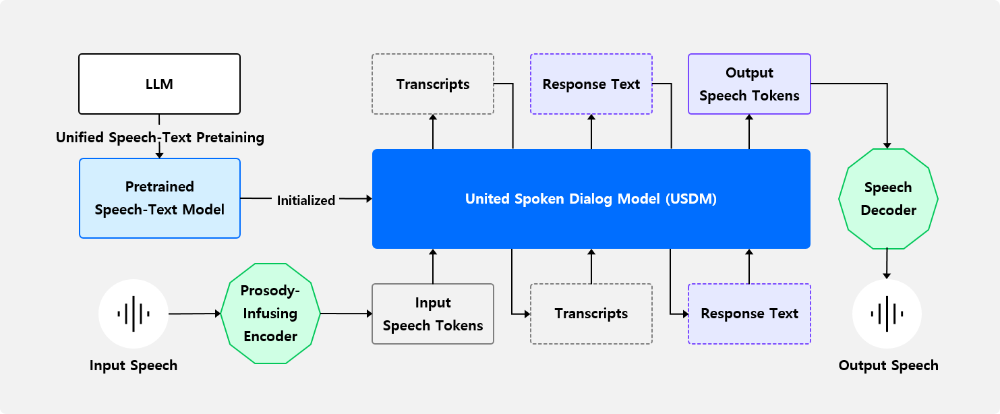

## Paralinguistics-Aware Speech-Empowered Large Language Models for Natural Conversation
> ### NeurIPS 2024 [[Paper](https://openreview.net/forum?id=NjewXJUDYq)] [[Code](https://github.com/naver-ai/usdm)] [[Project Page](https://unifiedsdm.github.io/)] [[🤗 Hugging Face Hub](https://huggingface.co/collections/naver-ai/usdm-67219a13bb48ef6a2c2bbecb)] <br> <br>
> #### Authors &emsp;&emsp; [Heeseung Kim](https://gmltmd789.github.io)<sup>1</sup>, [Soonshin Seo](https://scholar.google.co.kr/citations?user=ZKeGcP8AAAAJ)<sup>2</sup>, [Kyeongseok Jeong](https://scholar.google.com/citations?user=9LtiWbwAAAAJ)<sup>2</sup>, [Ohsung Kwon](https://www.linkedin.com/in/ohsung-kwon-78b091164)<sup>2</sup>, [Soyoon Kim](https://www.linkedin.com/in/soyoon-kim-b402a769)<sup>2</sup>, [Jungwhan Kim](https://scholar.google.com/citations?user=EB-MgDUAAAAJ)<sup>2</sup>, [Jaehong Lee](https://www.linkedin.com/in/jaehong-lee-74a0901b1)<sup>2</sup>, [Eunwoo Song](https://sewplay.github.io/)<sup>2</sup>, [Myungwoo Oh](https://www.linkedin.com/in/myungwoo5)<sup>2</sup>, [Jung-Woo Ha](https://scholar.google.com/citations?user=eGj3ay4AAAAJ)<sup>2</sup>, [Sungroh Yoon](https://scholar.google.com/citations?user=Bphl_fIAAAAJ)<sup>1,†</sup>, [Kang Min Yoo](https://scholar.google.com/citations?user=BqaWtH8AAAAJ)<sup>2,†</sup> <br> <sub> &emsp;&emsp;&emsp;&emsp;&emsp;&emsp;&emsp;&emsp; <sup>1</sup>Seoul National University, <sup>2</sup>NAVER Cloud, <sup>†</sup>Corresponding Authors</sub>
---
### Abstract
Recent work shows promising results in expanding the capabilities of large language models (LLM) to directly understand and synthesize speech. However, an LLM-based strategy for modeling spoken dialogs remains elusive, calling for further investigation. This paper introduces an extensive speech-text LLM framework, the Unified Spoken Dialog Model (USDM), designed to generate coherent spoken responses with naturally occurring prosodic features relevant to the given input speech without relying on explicit automatic speech recognition (ASR) or text-to-speech (TTS) systems. We have verified the inclusion of prosody in speech tokens that predominantly contain semantic information and have used this foundation to construct a prosody-infused speech-text model. Additionally, we propose a generalized speech-text pretraining scheme that enhances the capture of cross-modal semantics. To construct USDM, we fine-tune our speech-text model on spoken dialog data using a multi-step spoken dialog template that stimulates the chain-of-reasoning capabilities exhibited by the underlying LLM. Automatic and human evaluations on the DailyTalk dataset demonstrate that our approach effectively generates natural-sounding spoken responses, surpassing previous and cascaded baselines. Our code and checkpoints are available at [https://github.com/naver-ai/usdm](https://github.com/naver-ai/usdm).

---
### Overview


Our spoken dialog framework is structured in three parts:

1. **Speech Tokenizer**
   - We use speech tokens (vocab size = 10,000) from [SeamlessM4T](https://github.com/facebookresearch/seamless_communication/tree/main/src/seamless_communication/cli/m4t/audio_to_units), capturing essential semantic and paralinguistic information while minimizing vocabulary size for better generalization. For details and audio samples, see our [project page](https://unifiedsdm.github.io/) and [paper](https://openreview.net/forum?id=NjewXJUDYq).

2. **Spoken Dialog Model (USDM)**
   - Our model converts user speech tokens into response tokens using a two-stage training approach:
     1. Cross-modal training on a pre-trained LLM ([Mistral-7B-v0.1](https://huggingface.co/mistralai/Mistral-7B-v0.1)) to handle text and speech.
     2. Fine-tuning for spoken dialog on [DailyTalk](https://github.com/keonlee9420/DailyTalk).
   - The DailyTalk-trained model supports two speakers; for broader scenarios, consider datasets like [Fisher](https://catalog.ldc.upenn.edu/LDC2004S13) and [Switchboard](https://catalog.ldc.upenn.edu/LDC97S62). For new tasks, load the pre-trained checkpoint and fine-tune as needed.

3. **Speech Decoder**
   - The decoder converts model output into speech using a Voicebox-based mel-spectrogram generator and [BigVGAN](https://github.com/NVIDIA/BigVGAN) for speech synthesis. We trained the Voicebox model, while BigVGAN uses its official checkpoint.

We provide the following resources:

- [Interleaved sequence preprocessing method](preprocess/pre-training/README.md) for pre-training
- [Preprocessing method](preprocess/fine-tuning/README.md) for spoken dialog fine-tuning
- [Instructions and codes](src/README.md) for pre-training and supervised fine-tuning
- [Instructions and codes](src/decoder/README.md) for token-Voicebox training

For additional information, please refer to our [paper](https://openreview.net/forum?id=NjewXJUDYq).

---
### Checkpoints in 🤗 Hugging Face Hub

We provide pre-trained models through Hugging Face Hub. The speech tokenizer and vocoder are automatically downloaded via SeamlessM4T and Hugging Face Hub.

| **Repo Name**                                                                         | **Usage**                                                                                                                        |
|---------------------------------------------------------------------------------------|----------------------------------------------------------------------------------------------------------------------------------|
| [`naver-ai/xlsr-token-Voicebox`](https://huggingface.co/naver-ai/xlsr-token-Voicebox) | Token-Voicebox: Converts speech tokens to mel-spectrograms, supporting personalization via reference mel-spectrograms.           |
| [`naver-ai/USTM`](https://huggingface.co/naver-ai/USTM)                               | Unified Speech-Text Model (USTM): Further-trained Mistral-7B-v0.1 on speech-text data for customizable fine-tuning on new tasks. |
| [`naver-ai/USDM-DailyTalk`](https://huggingface.co/naver-ai/USDM-DailyTalk)           | Unified Spoken Dialog Model (USDM-DailyTalk): Fine-tuned USTM on DailyTalk with a single-turn spoken dialog setup.               |

---
### Demo and Inference

We provide a [Streamlit](https://streamlit.io/) demo. We also provide inference scripts based on [`transformers`](https://huggingface.co/docs/transformers) and  [`vLLM`](https://github.com/vllm-project/vllm) libraries. Follow these steps to set up the environment (tested on CUDA V12.4.131, Python 3.10.15, Conda 24.5.0):

```bash
# Step 1: Create and activate a new conda environment
conda create -n usdm python=3.10.15
conda activate usdm

# Step 2: Install common dependencies
conda install -c conda-forge libsndfile=1.0.31
pip install torch==2.2.1 torchvision==0.17.1 torchaudio==2.2.1 --index-url https://download.pytorch.org/whl/cu121
pip install fairseq2 --extra-index-url https://fair.pkg.atmeta.com/fairseq2/whl/pt2.2.1/cu121
pip install .
pip install flash-attn==2.6.3 --no-build-isolation
```

Our default generation strategy is set to greedy search. Feel free to experiment with different sampling strategies by modifying sampling parameters (top_k, top_p, temperature, num_beams, ...) to explore various output samples!

> **Note**
> - The released checkpoint of USDM is trained on DailyTalk using a single-turn template. For testing, we recommend using [samples from the speakers in DailyTalk](samples/) as inputs. If you wish to work with different speakers for input and output, we suggest fine-tuning our [provided pre-trained speech-text model](https://huggingface.co/naver-ai/USTM) on your specific dataset.
> - When you run the code, the checkpoints will be automatically downloaded to `YOUR_MODEL_CACHE_DIR` (excluding the unit extractor). You can change `YOUR_MODEL_CACHE_DIR` to save checkpoints to your preferred location.

#### Running Streamlit Demo
To start Streamlit, use the following command:

```bash
MODEL_CACHE_DIR=YOUR_MODEL_CACHE_DIR CUDA_VISIBLE_DEVICES=gpu_id streamlit run src/streamlit_demo.py --server.port YOUR_PORT
```
Access the demo at `localhost:YOUR_PORT`.
> **Note**: USDM is trained on DailyTalk and may perform less optimally for voices outside of this dataset.

#### Standard Inference
```bash
# transformers-based (model.generate())
CUDA_VISIBLE_DEVICES=gpu_id python src/inference.py --input_path INPUT_WAV_PATH --output_path PATH_TO_SAVE_SPOKEN_RESPONSE --model_cache_dir YOUR_MODEL_CACHE_DIR

# vLLM-based
CUDA_VISIBLE_DEVICES=gpu_id python src/inference_vllm.py --input_path INPUT_WAV_PATH --output_path PATH_TO_SAVE_SPOKEN_RESPONSE --model_cache_dir YOUR_MODEL_CACHE_DIR
```

#### Speaker-Adaptive Inference (Using Reference Audio)
To generate a response that adapts to a reference speaker’s voice, add the `reference_path` argument:
```bash
# transformers-based (model.generate())
CUDA_VISIBLE_DEVICES=gpu_id python src/inference.py --input_path INPUT_WAV_PATH --reference_path REFERENCE_WAV_PATH --output_path PATH_TO_SAVE_SPOKEN_RESPONSE --model_cache_dir YOUR_MODEL_CACHE_DIR

# vLLM-based
CUDA_VISIBLE_DEVICES=gpu_id python src/inference_vllm.py --input_path INPUT_WAV_PATH --reference_path REFERENCE_WAV_PATH --output_path PATH_TO_SAVE_SPOKEN_RESPONSE --model_cache_dir YOUR_MODEL_CACHE_DIR
```

> **Note**: To generate spoken responses in the desired speaker's voice, our model requires 1. reference audio from the target speaker, and 2. the target speaker's speech token to be generated through USDM. The current single-turn USDM model, fine-tuned on DailyTalk, is optimized for two specific speakers and generates speech tokens for these speakers, which may limit its adaptability to other voices.
> 


> **Potential Solution**: To address this, USDM must be trained to robustly generate speech tokens for unseen speakers. This can be achieved by training USDM on a multi-turn, multi-speaker dataset (e.g., Fisher), enabling it to generate speech tokens for unseen speakers by learning to produce consistent speech tokens for the same speaker across multiple turns. For more detailed explanations and examples, please refer to the multi-turn Fisher examples on our [project page](https://unifiedsdm.github.io/) and Section A.1 of our [paper](https://openreview.net/forum?id=NjewXJUDYq).

---
### BibTeX
```
@inproceedings{
   kim2024paralinguisticsaware,
   title={Paralinguistics-Aware Speech-Empowered Large Language Models for Natural Conversation},
   author={Heeseung Kim and Soonshin Seo and Kyeongseok Jeong and Ohsung Kwon and Soyoon Kim and Jungwhan Kim and Jaehong Lee and Eunwoo Song and Myungwoo Oh and Jung-Woo Ha and Sungroh Yoon and Kang Min Yoo},
   booktitle={The Thirty-eighth Annual Conference on Neural Information Processing Systems},
   year={2024},
   url={https://openreview.net/forum?id=NjewXJUDYq}
}
```
---
### License
```
USDM
Copyright (c) 2024-present NAVER Cloud Corp.
Licensed under the Apache License, Version 2.0 (the "License");
you may not use this file except in compliance with the License.
You may obtain a copy of the License at
    http://www.apache.org/licenses/LICENSE-2.0
Unless required by applicable law or agreed to in writing, software
distributed under the License is distributed on an "AS IS" BASIS,
WITHOUT WARRANTIES OR CONDITIONS OF ANY KIND, either express or implied.
See the License for the specific language governing permissions and
limitations under the License.
```

---
### References
- Speech Token Extractor: [SeamlessM4T](https://github.com/facebookresearch/seamless_communication)
- Example dataset for code demonstration: [DailyTalk](https://github.com/keonlee9420/DailyTalk), [LibriTTS](https://openslr.org/60/)
- Pre-training
  - Pre-processing / Alignment Search: [Montreal-Forced-Aligner](https://montreal-forced-aligner.readthedocs.io/en/latest/)
  - Pre-processing / Data Packing: [Multipack Sampler](https://github.com/imoneoi/multipack_sampler/blob/master/multipack_sampler_linear.py)
  - Custom Model / Preventing [Cross-Contamination](https://github.com/huggingface/trl/issues/805#issuecomment-1745166383): [Mistral-7B-v0.1 in Transformers](https://github.com/huggingface/transformers/blob/v4.40.2/src/transformers/models/mistral/modeling_mistral.py), [Flash-Attention](https://github.com/Dao-AILab/flash-attention)
- Token Decoder
  - Token-Voicebox Code Structure, Model Architecture: [Glow-TTS](https://github.com/jaywalnut310/glow-tts), [Grad-TTS](https://github.com/huawei-noah/Speech-Backbones/tree/main/Grad-TTS), [Transformers](https://github.com/huggingface/transformers), [Matcha-TTS](https://github.com/shivammehta25/Matcha-TTS), [xformers](https://github.com/facebookresearch/xformers)
  - Mel-spectrogram to Speech Decoder: [BigVGAN](https://github.com/NVIDIA/BigVGAN)
