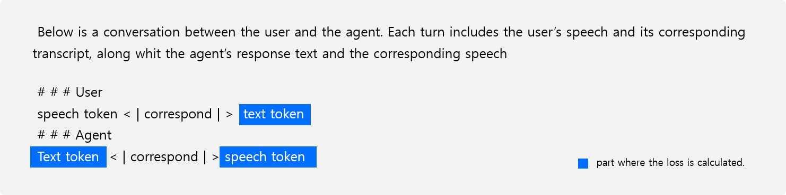

## Preprocessing for Supervised Fine-tuning

Our training approach includes Speech-Text Cross-Modal Pre-training and Fine-tuning for downstream tasks. This directory contains code for preprocessing data, specifically DailyTalk, for single-turn spoken response modeling.

---

### Preprocessing Overview

We provide code to preprocess approximately 20 hours of two-speaker conversations from the [DailyTalk dataset](https://arxiv.org/pdf/2207.01063) for single-turn spoken dialog modeling. Following the setup in our paper, we preprocess the data according to the template shown below.



> **Note**
> - As outlined in our paper, instead of generating a direct spoken response to user input, we first create transcript and text response, then produce the spoken response. This approach, inspired by [SpeechGPT](https://arxiv.org/abs/2305.11000) and [AudioPaLM](https://arxiv.org/abs/2306.12925), allows us to fully utilize the text modeling capabilities of pre-trained speech-text models.
> - Instead of calculating loss to all tokens in the template, we calculate it only to the parts highlighted in blue in the template image above.
> - Our code is based on DailyTalk. For other datasets and tasks, adapt this code as needed.

---

### Setup

- Environment tested on CUDA V12.4.131, Python 3.10.15, Conda 24.5.0.
```bash
# Step 1: Create and activate a new conda environment
conda create -n usdm python=3.10.15
conda activate usdm

# Step 2: Install common dependencies
conda install -c conda-forge libsndfile=1.0.31
pip install torch==2.2.1 torchvision==0.17.1 torchaudio==2.2.1 --index-url https://download.pytorch.org/whl/cu121
pip install .
pip install flash-attn==2.6.3 --no-build-isolation
```

---

### Step 1: Download Dataset

- Download [DailyTalk](https://github.com/keonlee9420/DailyTalk?tab=readme-ov-file), extract, and structure as follows:
```plaintext
YOUR_DATA_PATH/
├── data/
└── metadata.json
```

We also use metadata from the [official DailyTalk repository](https://github.com/keonlee9420/DailyTalk). Please download `train_phone.txt` and `val_phone.txt` from this [link](https://github.com/keonlee9420/DailyTalk/tree/main/preprocessed_data/DailyTalk), rename them to `train.txt` and `test.txt`, and place them in the `dataset/fine-tuning/dailytalk/raw` directory.

---

### Step 2: Processing Dataset to Desired Template

This code converts data into the specified template above and extracts masked labels to calculate loss only for the regions highlighted in blue.

```bash
python dailytalk_single_turn.py --pretrained_model_name_or_path naver-ai/USTM --model_cache_dir YOUR_MODEL_CACHE_DIR --data_dir YOUR_DATA_PATH/data
```

- This processing generates `train.txt` and `test.txt` files in [dataset/fine-tuning/dailytalk/preprocessed](../../dataset/fine-tuning/dailytalk/preprocessed), which you can use for Supervised Fine-tuning (SFT).
- The tokenizer required for preprocessing is automatically saved in `YOUR_MODEL_CACHE_DIR`.
- For more details on SFT, refer to the [README](../../src/README.md).