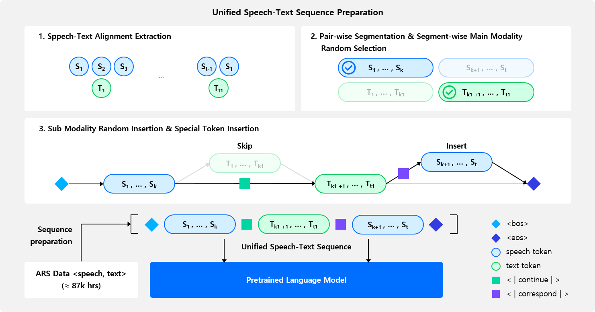
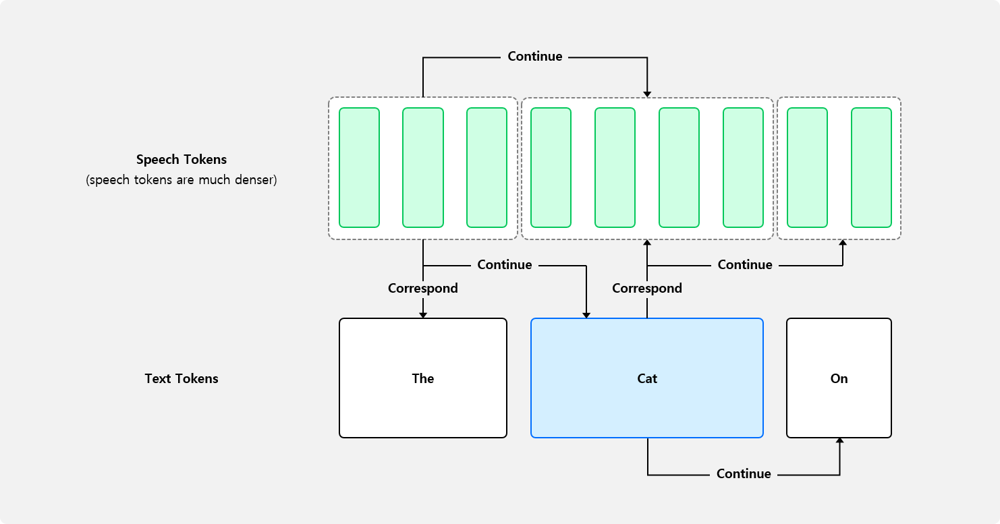

## Preprocessing for Pre-training

Our training approach consists of Speech-Text Cross-Modal Pre-training and Fine-tuning for downstream tasks. This directory contains the necessary code to prepare speech-text interleaved sequences for pre-training.

--- 

### Preprocessing Overview


Our Unified Speech-Text Pre-training aims to extend a Pre-trained LLM (e.g., Llama 3, Mistral) to handle both text and speech input/output. Using paired `<text, speech>` data, we create interleaved sequences to further train models like `Mistral-7B-v0.1`.

Our interleaved sequence design aims to include:
- Speech-only sequences
- Text-only sequences
- Interleaved sequences with diverse speech-text relationships 

Two core relationships between speech and text: Correspondence and Continuation


For more details, refer to our [paper](https://openreview.net/forum?id=NjewXJUDYq).

Our pre-training preprocessing follows these steps. The example below uses `LibriTTS dev-clean` for illustration, while the pre-trained checkpoint was trained on:

- [Multilingual LibriSpeech (en)](https://www.openslr.org/94/)
- [GigaSpeech](https://github.com/SpeechColab/GigaSpeech)
- [VoxPopuli (en)](https://github.com/facebookresearch/voxpopuli)
- [People’s Speech](https://mlcommons.org/datasets/peoples-speech/)
- [Common Voice 15.0](https://huggingface.co/datasets/mozilla-foundation/common_voice_15_0)

> **Note**
> - For other datasets, save transcripts as `FILENAME.txt` and units as `FILENAME_unit.txt` next to the corresponding audio files (e.g., `FILENAME.wav`).
> - Our code currently uses the Montreal Forced Aligner for speech-text alignment. For other languages, consider:
  >   - [Montreal Forced Aligner](https://mfa-models.readthedocs.io/en/latest/acoustic/index.html) model for your target language (Recommended)
  >   - [UnitY2 forced alignment extractor](https://github.com/facebookresearch/seamless_communication/blob/main/docs/m4t/unity2_aligner_README.md) (requires GPU)

---
### Setup
Environment tested on CUDA V12.4.131, Python 3.10.15, Conda 24.5.0.
```bash
# Step 1: Create and activate a new conda environment
conda create -n usdm python=3.10.15
conda activate usdm

# Step 2: Install common dependencies
conda install -c conda-forge libsndfile=1.0.31
pip install torch==2.2.1 torchvision==0.17.1 torchaudio==2.2.1 --index-url https://download.pytorch.org/whl/cu121
pip install .
pip install flash-attn==2.6.3 --no-build-isolation
cd preprocess/pre-training
```

---
### Step 1: Dataset Preparation (Download, Text Processing, Token Extraction, and Alignment Extraction)

Download [LibriTTS dev-clean](https://openslr.org/60/), extract, and use the following structure.
```plaintext
YOUR_DATA_PATH/
├── dev-clean/
└── ...
```

```bash
# Step 1: Preprocess transcript and extract speech token
python stage1.py --data_path YOUR_DATA_PATH

# Step 2: Create and activate a new conda environment for alignment extraction
conda deactivate
conda create -n mfa python=3.10.15
conda activate mfa
conda install -c conda-forge montreal-forced-aligner=2.2.17

# Step 3: Extract alignment
mfa model download acoustic english_mfa
mfa model download dictionary english_mfa
mfa align YOUR_DATA_PATH/dev-clean english_mfa english_mfa YOUR_DATA_PATH/dev-clean-textgrid -t YOUR_TEMP_DIR -j NUM_JOBS

# Step 4: Return to Original Environment (usdm)
conda deactivate
conda activate usdm
```
Here, `YOUR_TEMP_DIR` is the temporary directory for alignment files, and `NUM_JOBS` specifies the number of processes. 

> **Note**: When installing `montreal-forced-aligner`, we observed that it can cause conflicts with other dependencies. We recommend creating a separate conda environment specifically for MFA to avoid these issues.

--- 
### Step 2: Calculate Alignment Between Units and Text

```bash
python stage2.py --pretrained_model_name_or_path mistralai/Mistral-7B-v0.1 --model_cache_dir YOUR_MODEL_CACHE_DIR --data_path YOUR_DATA_PATH/dev-clean-textgrid --output_path YOUR_DATA_PATH/dev-clean-alignment --epoch EPOCH_FOR_PRETRAINING
```

Adjust `pretrained_model_name_or_path` to load any compatible LLM from `transformers` or a custom model. The loaded tokenizer will be saved in `YOUR_MODEL_CACHE_DIR`.
> **Note:** We preprocess all `<speech, text>` paired data into interleaved sequences before pre-training to use [multipack_sampler](https://github.com/imoneoi/multipack_sampler).

Multipack Sampler Details:
  - We use [Mistral-7B-v0.1](https://huggingface.co/mistralai/Mistral-7B-v0.1) with a max length of 8,192.
  - Each interleaved sample is shorter than 8,192, so we concatenate samples to maximize training efficiency. `multipack_sampler` calculates optimal combinations for samples up to 8,192 in length.
  - Even within the same <speech, text> pair, the interleaving pattern changes with each epoch, leading to variations in sequence length. Since these variable sequence lengths impact packing, on-the-fly processing becomes challenging. Therefore, **we pre-pack samples per epoch in advance**.
---
### Step 3: Data Packing (using Multipack Sampler)

```bash
python stage3.py --data_path YOUR_DATA_PATH/dev-clean-alignment --output_path YOUR_DATA_PATH/dev-clean-packing --epoch EPOCH_FOR_PRETRAINING
```

Running this script creates packed files (e.g., `part0.txt` to `partN.txt`).

---
### Step 4: Data Caching for Pre-training

```bash
python stage4.py --train_dataset_path YOUR_TRAINING_DATA_PATH \
                 --validation_dataset_path YOUR_VALIDATION_DATA_PATH \
                 --output_path YOUR_OUTPUT_DIR \
                 --cache_path YOUR_CACHE_DIR
```

For example, with `LibriTTS dev-clean`:
```bash
python stage4.py --train_dataset_path YOUR_DATA_PATH/dev-clean-packing/part0.txt \
                 --validation_dataset_path YOUR_DATA_PATH/dev-clean-packing/part0.txt \
                 --output_path YOUR_OUTPUT_DIR \
                 --cache_path YOUR_CACHE_DIR
```

The example uses the `dev-clean` subset without splitting train/dev/test. For actual pre-training, provide distinct datasets for each split. 

If Stage 3 outputs multiple files, you can list paths as needed:
```bash
python stage4.py --train_dataset_path YOUR_DATA_PATH/dev-clean-packing/part0.txt YOUR_DATA_PATH/dev-clean-packing/part1.txt \
                 --validation_dataset_path YOUR_DATA_PATH/dev-clean-packing/part0.txt \
                 --output_path YOUR_OUTPUT_DIR \
                 --cache_path YOUR_CACHE_DIR
```

With this setup, you can start unified speech-text pretraining using the files and `src/train_pt.py`. Please refer to the [README](../../src/README.md) related to training.
